# Discord Bridge Setup

Receive website chat messages directly in Discord using threads.

```mermaid
sequenceDiagram
    participant V as Website Visitor
    participant D as Discord (#support-chat)

    V->>D: "Hi, I need help..."
    Note over D: 🧵 Visitor (Paris) - new thread
    D->>V: "Sure! How can I help?"
    Note over V,D: Each visitor = Separate thread
```



---

## Prerequisites

- Discord account
- Server where you have admin permissions (or can create one)

---

## Step 1: Create a Discord Bot

1. Go to [discord.com/developers/applications](https://discord.com/developers/applications)
2. Click **New Application** → Name: `PocketPing Support` → Create
3. Go to **Bot** in sidebar → Click **Add Bot**
4. **Enable MESSAGE CONTENT INTENT** (required!)
5. Click **Reset Token** → Copy the token

:::warning Message Content Intent
Without enabling MESSAGE CONTENT INTENT, your bot cannot read message contents. This is a required step!
:::

---

## Step 2: Invite Bot to Server

1. Go to **OAuth2** → **URL Generator** in the sidebar
2. Select Scopes: `bot`, `applications.commands`
3. Select Bot Permissions:

| Permission | Required |
|------------|----------|
| Send Messages | ✅ |
| Create Public Threads | ✅ |
| Send Messages in Threads | ✅ |
| Manage Threads | ✅ |
| Read Message History | ✅ |
| View Channels | ✅ |

4. Copy the generated URL → Open in browser → Select your server → Authorize

---

## Step 3: Get Channel ID

1. **Enable Developer Mode**: User Settings → App Settings → Advanced → Toggle ON
2. **Right-click** on your support channel → **Copy Channel ID**

Channel ID looks like: `1234567890123456789` (long number, no dashes)

---

## Step 4: Configure PocketPing

### SaaS Users

1. Go to [app.pocketping.io/settings/bridges](https://app.pocketping.io/settings/bridges)
2. Click "Add Discord"
3. Enter:
   - **Bot Token:** `ODk2NzI5MTk4...`
   - **Channel ID:** `1234567890123456789`
4. Click "Save"

### Self-Hosted Users

Add to your `.env` file:

```bash title=".env"
DISCORD_BOT_TOKEN=ODk2NzI5MTk4NTUyMDk1NzQ0.YOUR_TOKEN_HERE
DISCORD_CHANNEL_ID=1234567890123456789
```

Then restart your bridge server:

```bash
docker compose restart bridge
```

---

## Test Your Setup

1. **Open your website** with the widget installed
2. **Send a test message** in the chat widget
3. **Check Discord** - a new thread appears: `🧵 New Visitor (Paris, France)`
4. **Reply in the thread** - your reply appears in the widget!

---

## Bot Commands

Use slash commands in a visitor's thread:

| Command | What it does |
|---------|-------------|
| `/info` | Shows visitor details (location, browser, page URL, etc.) |
| `/close` | Closes the conversation and archives the thread |
| `/ai on` | Enables AI fallback for this conversation |
| `/ai off` | Disables AI fallback for this conversation |

### Example: `/info` Response

```
Session: sess_abc123
Location: Paris, France
Browser: Chrome 120 / macOS
Page: https://yoursite.com/pricing
Started: 5 minutes ago
```

---

## Troubleshooting

### Bot not responding?

| Problem | Solution |
|---------|----------|
| Wrong token | Regenerate token in Developer Portal |
| MESSAGE CONTENT INTENT disabled | Enable in Bot settings → Privileged Intents |
| Bot not in server | Use the OAuth2 URL generator to invite |
| Missing permissions | Re-invite with correct permissions |

### Threads not being created?

| Problem | Solution |
|---------|----------|
| No "Create Public Threads" permission | Re-invite bot with this permission |
| Wrong channel ID | Double-check Developer Mode is on, re-copy ID |
| Bot can't see channel | Check channel permissions for bot role |

### Messages not syncing?

| Problem | Solution |
|---------|----------|
| Bot can't read messages | Enable MESSAGE CONTENT INTENT |
| No "Send Messages in Threads" | Re-invite with this permission |
| Server not running | Check logs: `docker logs pocketping-bridge` |

### Debug checklist

- [ ] Bot token is correct (no extra spaces)
- [ ] MESSAGE CONTENT INTENT is enabled
- [ ] Bot is in the server
- [ ] Bot has required permissions
- [ ] Channel ID is correct (long number)
- [ ] Bot can see the target channel
- [ ] Bridge server is running and healthy

---

## Permission Summary

Here's exactly what each permission does:

| Permission | Why Needed |
|-----------|------------|
| Send Messages | Post visitor messages to channel |
| Create Public Threads | Create thread for each visitor |
| Send Messages in Threads | Reply within threads |
| Manage Threads | Archive/close threads |
| Read Message History | See previous messages |
| View Channels | Access the support channel |

---

## Advanced: Notifications

Configure Discord to notify you on new messages:

1. Right-click the support channel
2. Notification Settings → All Messages
3. You'll be notified for every new visitor message

For mobile:
- Enable push notifications in Discord mobile app
- Set channel notifications to "All Messages"

---

## Next Steps

- **[Telegram Bridge](/bridges/telegram)** - Add Telegram as another channel
- **[Slack Bridge](/bridges/slack)** - Add Slack as another channel
- **[AI Fallback](/ai-fallback)** - Auto-respond when you're away
- **[Backend SDK](/sdk/nodejs)** - Handle events programmatically
