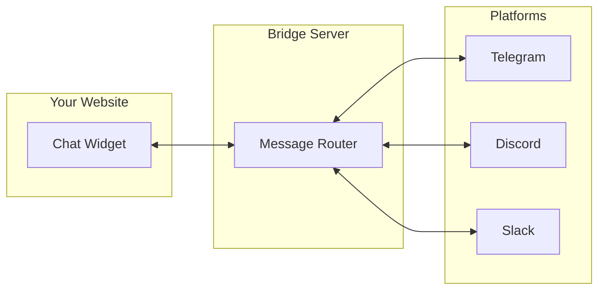
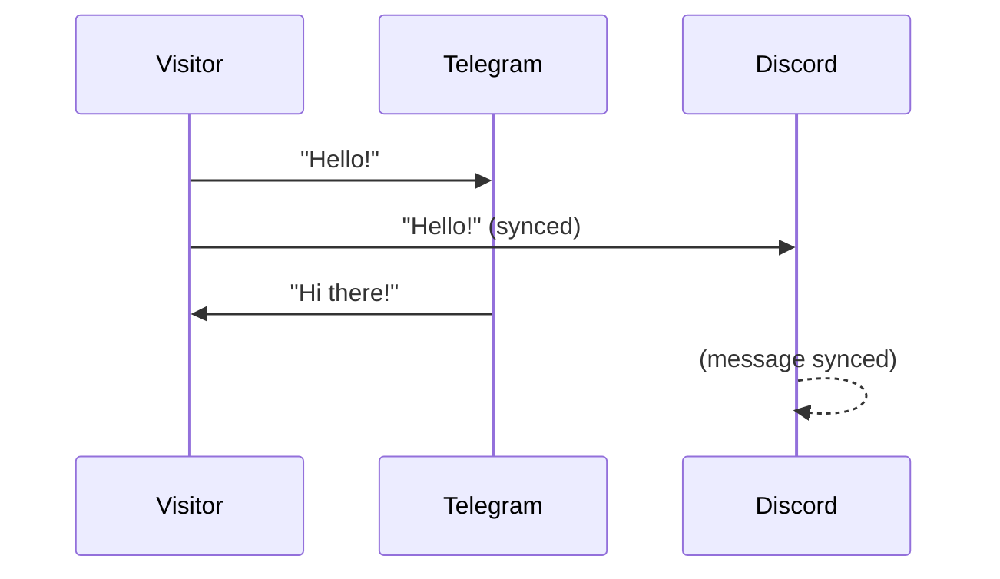

# Bridges

Bridges connect your website chat to messaging platforms where you already work.



## How Bridges Work

1. **Visitor sends message** → Widget forwards to bridge server
2. **Bridge creates thread** → New topic (Telegram), thread (Discord/Slack)
3. **You reply** → Message appears in widget instantly
4. **Visitor sees response** → Real-time via WebSocket

## Available Bridges

| Platform | Thread Type | Best For |
|----------|-------------|----------|
| [**Telegram**](./telegram) | Forum Topics | Mobile-first teams, personal use |
| [**Discord**](./discord) | Channel Threads | Gaming, communities, dev teams |
| [**Slack**](./slack) | Channel Threads | Enterprise, business teams |

## Features Comparison

| Feature | Telegram | Discord | Slack |
|---------|----------|---------|-------|
| Mobile app | Excellent | Good | Good |
| Notifications | Instant | Good | Good |
| Thread organization | Topics | Threads | Threads |
| Free tier | Unlimited | Unlimited | Limited history |
| Bot commands | `/info`, `/close`, `/ai` | Same | Same |
| Rich messages | ✅ | ✅ | ✅ |
| File sharing | ✅ | ✅ | ✅ |

## Multi-Bridge Setup

You can connect multiple bridges simultaneously. Messages sync across all platforms.



### Configuration

```bash title=".env"
# Connect both Telegram and Discord
TELEGRAM_BOT_TOKEN=your_telegram_token
TELEGRAM_FORUM_CHAT_ID=-1001234567890

DISCORD_BOT_TOKEN=your_discord_token
DISCORD_CHANNEL_ID=1234567890123456789
```

## Choosing a Bridge

| If you... | Use |
|-----------|-----|
| Want the simplest setup | **Telegram** |
| Already use Discord for your community | **Discord** |
| Work in a business environment | **Slack** |
| Need mobile notifications | **Telegram** (best mobile app) |
| Want unlimited free history | **Telegram** or **Discord** |

## Self-Hosted vs SaaS

### SaaS (app.pocketping.io)
- Configure bridges in dashboard
- No server management
- Automatic updates

### Self-Hosted
- Full control over data
- Configure via environment variables
- Deploy with Docker

See [Self-Hosting Guide](/self-hosting) for deployment instructions.

## Next Steps

- [Telegram Setup](./telegram) - Most popular, easiest setup
- [Discord Setup](./discord) - Great for dev teams
- [Slack Setup](./slack) - Enterprise-ready
- [Docker Deployment](./docker) - Self-host the bridge server
