# Telegram Bridge Setup

Receive website chat messages directly in Telegram using Forum Topics.

```mermaid
sequenceDiagram
    participant V as Website Visitor
    participant T as Telegram Group

    V->>T: "Hi, I need help..."
    Note over T: 📁 Visitor from Paris (new topic)
    T->>V: "Sure! How can I help?"
    Note over V,T: Each visitor = Separate topic
```



---

## Prerequisites

- Telegram account
- Ability to create groups in Telegram

---

## Step 1: Create a Bot with BotFather

1. Open Telegram and search for **@BotFather**
2. Send `/newbot`
3. Choose display name: `Acme Support Bot`
4. Choose username: `acme_support_bot` (must end in "bot")
5. **Save the token** BotFather gives you

**Your bot token looks like:** `123456789:ABCdefGHIjklMNOpqrsTUVwxyz`

:::warning Keep it secret
Never share your bot token publicly. It gives full control over your bot.
:::

---

## Step 2: Create a Supergroup with Topics

Forum Topics let each visitor have their own organized thread.

1. **Create a new group** in Telegram → Name it `Acme Support Chat`
2. **Open Group Settings** → Tap group name → Edit
3. **Enable Topics** → Group Type → Enable "Topics" (converts to supergroup)
4. (Optional) **Add team members** → They'll all see visitor messages

:::info Why Forum Topics?
Without topics, all messages go to a single chat → chaos. With topics, each visitor conversation is isolated → organized support.
:::

---

## Step 3: Add Bot as Admin

The bot needs admin permissions to create topics and post messages.

1. Open your support group → **Settings** → **Administrators**
2. Tap **Add Administrator** → Search for your bot (`@acme_support_bot`)
3. Grant these permissions:

| Permission | Required | Why |
|------------|----------|-----|
| Manage Topics | ✅ Yes | Create visitor threads |
| Post Messages | ✅ Yes | Send messages |
| Edit Messages | ✅ Yes | Update messages |
| Delete Messages | ✅ Yes | Cleanup |
| Change Group Info | ❌ No | Not needed |
| Add Users | ❌ No | Not needed |

4. Tap **Done**

---

## Step 4: Get the Chat ID

You need the group's Chat ID (a number starting with `-100`).

### Method A: Using @userinfobot (Easiest)

1. Temporarily add **@userinfobot** to your group
2. It replies with: `ID: -1001234567890` → **Copy this number**
3. Remove @userinfobot from the group

### Method B: Using the Telegram API

```bash
# First, send any message in your group, then run:
curl "https://api.telegram.org/bot<YOUR_BOT_TOKEN>/getUpdates" | jq

# Look for:
# "chat": {
#   "id": -1001234567890,  ← This is your Chat ID
#   "title": "Acme Support Chat",
#   "type": "supergroup"
# }
```

:::tip Chat ID format
Supergroup chat IDs always start with `-100` followed by digits. Example: `-1001234567890`
:::

---

## Step 5: Configure PocketPing

### SaaS Users

1. Go to [app.pocketping.io/settings/bridges](https://app.pocketping.io/settings/bridges)
2. Click "Add Telegram"
3. Enter:
   - **Bot Token:** `123456789:ABCdefGHIjklMNOpqrs...`
   - **Chat ID:** `-1001234567890`
4. Click "Save"

### Self-Hosted Users

Add to your `.env` file:

```bash title=".env"
TELEGRAM_BOT_TOKEN=123456789:ABCdefGHIjklMNOpqrsTUVwxyz
TELEGRAM_FORUM_CHAT_ID=-1001234567890
```

Then restart your bridge server:

```bash
docker compose restart bridge
```

---

## Test Your Setup

1. **Open your website** with the widget installed
2. **Send a test message** in the chat widget
3. **Check Telegram** - a new topic appears: `📁 New Visitor (Paris, France)`
4. **Reply in the topic** - your reply appears in the widget!

---

## Bot Commands

Inside a visitor's topic thread, use these commands:

| Command | What it does |
|---------|-------------|
| `/info` | Shows visitor details (location, browser, page URL, etc.) |
| `/close` | Closes the conversation and archives the topic |
| `/ai on` | Enables AI fallback for this conversation |
| `/ai off` | Disables AI fallback for this conversation |

### Example: `/info` Response

```
Session ID: sess_abc123
Visitor ID: vis_xyz789

Location: Paris, France
Browser: Chrome 120 on macOS
Page: https://yoursite.com/pricing
Started: 2 minutes ago

User Info (if identified):
Email: john@example.com
Plan: Pro
```

---

## Troubleshooting

### Bot not responding?

| Problem | Solution |
|---------|----------|
| Wrong token | Regenerate token with @BotFather using `/token` |
| Bot not admin | Add bot as admin with required permissions |
| Wrong chat ID | Must start with `-100` (supergroup format) |
| Server not running | Check logs: `docker logs pocketping-bridge` |

### Topics not being created?

| Problem | Solution |
|---------|----------|
| Topics disabled | Enable Topics in Group Settings → Edit |
| No "Manage Topics" permission | Re-add bot as admin with this permission |
| Regular group (not super) | Convert to supergroup by enabling Topics |

### Messages not syncing?

| Problem | Solution |
|---------|----------|
| Bot can't read messages | Ensure "Post Messages" permission is granted |
| Webhook issue | Check if bridge server is accessible publicly |
| Network issue | Verify firewall allows outbound HTTPS |

### Debug checklist

- [ ] Bot token is correct (no extra spaces)
- [ ] Chat ID starts with `-100`
- [ ] Bot is admin in the group
- [ ] "Manage Topics" permission is granted
- [ ] Topics are enabled in group settings
- [ ] Bridge server is running and healthy
- [ ] Widget is correctly configured with projectId/endpoint

---

## Advanced: Multiple Groups

You can route different projects to different Telegram groups:

```bash title=".env"
# Project 1 → Support group
TELEGRAM_BOT_TOKEN=xxx
TELEGRAM_FORUM_CHAT_ID=-1001111111111

# For multiple projects, use the SDK:
# See SDK documentation for per-project routing
```

---

## Next Steps

- **[Discord Bridge](/bridges/discord)** - Add Discord as another channel
- **[Slack Bridge](/bridges/slack)** - Add Slack as another channel
- **[AI Fallback](/ai-fallback)** - Auto-respond when you're away
- **[Backend SDK](/sdk/nodejs)** - Handle events programmatically
