# Core Concepts

This page explains how PocketPing works under the hood. Understanding these concepts will help you get the most out of the platform.

---

## Architecture Overview

PocketPing has a modular architecture with three main components:


### Component Details

| Component | Size | Role | You Need To... |
|-----------|------|------|----------------|
| **Widget** | ~15KB | Chat UI + event handling | Add 2 lines of code |
| **Bridge Server** | - | Message routing + storage | Use SaaS or self-host |
| **Bridges** | - | Platform integrations | Configure credentials |
| **Backend SDK** | Optional | Custom logic + webhooks | `npm install` / `pip install` |

---

## Sessions

A **session** represents a conversation between a visitor and your team.

### Session Lifecycle


### Session Properties

Sessions persist across page refreshes using a browser fingerprint:

```typescript
// Session object structure
{
  id: "sess_abc123",           // Unique session ID
  visitorId: "vis_xyz789",     // Browser fingerprint
  projectId: "proj_def456",    // Your project
  messages: [...],             // Conversation history
  metadata: {
    url: "https://yoursite.com/pricing",
    country: "France",
    browser: "Chrome",
    device: "desktop"
  },
  status: "active",            // "active" | "closed"
  createdAt: "2024-01-15T10:30:00Z",
  lastActivity: "2024-01-15T10:35:00Z"
}
```

### Same Visitor, Same Session


---

## Bridges

Bridges connect PocketPing to messaging platforms. They handle bidirectional sync.

### Supported Bridges

| Platform | Thread Type | Best For |
|----------|-------------|----------|
| **Telegram** | Topics in supergroup | Mobile-first, personal |
| **Discord** | Threads in channel | Team support, gaming |
| **Slack** | Threads in channel | Enterprise, team collaboration |

### How Bridges Work

```mermaid
flowchart LR
    subgraph bridge["Bridge Server"]
        data["Sessions<br/>Messages<br/>Events"]
    end

    subgraph tg["Telegram Group"]
        t1["📁 General"]
        t2["📁 John (visitor 1)"]
        t3["📁 Sarah (visitor 2)"]
        t4["📁 Mike (visitor 3)"]
    end

    data <-->|"Bidirectional<br/>Real-time"| tg
```



Each visitor = 1 topic/thread. All messages sync in real-time.

### Multi-Bridge Sync

You can connect multiple bridges simultaneously. Messages sync across all platforms:


**Reply from ANY platform → Delivered to visitor instantly**

:::tip Team Flexibility
Your team can use their preferred platform. Mobile users might prefer Telegram, while office-based team members use Slack.
:::

---

## Message Flow

Here's exactly what happens when a message is sent:

### Visitor → You


### You → Visitor


---

## Custom Events

Beyond chat messages, you can send **custom events** between the widget and your backend.

### Event Flow


### Use Cases

| Event | Direction | Example |
|-------|-----------|---------|
| `clicked_pricing` | Widget → Backend | Track when visitors view pricing |
| `form_submitted` | Widget → Backend | Log form submissions |
| `show_discount` | Backend → Widget | Display personalized offer |
| `highlight_feature` | Backend → Widget | Guide visitor to a feature |

### Example: Pricing Tracker

**Widget (frontend):**
```javascript
// When visitor clicks pricing
PocketPing.trigger('clicked_pricing', {
  plan: 'pro',
  source: 'homepage'
});
```

**Backend (Node.js):**
```javascript
const pp = new PocketPing({
  onEvent: (event, session) => {
    if (event.name === 'clicked_pricing') {
      // Log to analytics
      analytics.track('pricing_view', event.data);

      // Notify team
      console.log(`${session.metadata.country} visitor interested in ${event.data.plan}`);
    }
  }
});
```

---

## Projects

A **project** represents one website or application in PocketPing.

### Project Structure

A project contains:

| Section | Contents |
|---------|----------|
| **Keys** | `pk_live_xxx` (widget), `sk_live_xxx` (backend SDK) |
| **Widget Settings** | Color, operator name, welcome message, position |
| **Connected Bridges** | Telegram, Discord, Slack configurations |

### Multiple Projects

You can have multiple projects for different sites or environments:

| Project | Domain | Bridges |
|---------|--------|---------|
| Production | `yoursite.com` | Production Telegram group |
| Staging | `staging.yoursite.com` | Test Telegram group |
| Another Site | `otherbrand.com` | Different Telegram group |

---

## AI Fallback

When you're away, AI can respond to visitors using your custom instructions.

### How It Works


### Configuration

```typescript
// AI Fallback settings
{
  enabled: true,
  delayMinutes: 2,           // Wait before AI responds
  systemPrompt: `
    You are a helpful support agent for Acme Inc.
    - Be friendly and professional
    - If you don't know, say so and offer to connect with a human
    - Our business hours are 9am-6pm EST
  `,
  knowledgeBase: [
    { type: 'url', value: 'https://docs.acme.com' },
    { type: 'file', value: 'faq.md' }
  ]
}
```

---

## Security

### Data Flow


- All connections encrypted (TLS 1.3)
- Messages encrypted at rest (AES-256)
- No visitor PII stored without consent

### Self-Hosting Option

For complete data control, you can self-host:

| Component | Self-Host? | Notes |
|-----------|------------|-------|
| Widget | Always self-served | Loaded from your domain or CDN |
| Bridge Server | Optional | Docker image available |
| Bridges | Run anywhere | Your credentials, your infra |
| Database | Optional | Postgres, MySQL, SQLite supported |

→ See [Self-Hosting Guide](/self-hosting) for details.

---

## Next Steps

Now that you understand the concepts:

- **[Quick Start](/quickstart)** - Get running in 5 minutes
- **[Widget Configuration](/widget/configuration)** - Customize appearance and behavior
- **[Telegram Bridge](/bridges/telegram)** - Set up Telegram integration
- **[Custom Events](/widget/configuration#custom-events)** - Track user actions
- **[AI Fallback](/ai-fallback)** - Configure automatic responses
