# Welcome to PocketPing

**PocketPing** is a lightweight chat widget that forwards messages to your favorite messaging apps (Telegram, Discord, Slack) and lets you reply directly from there.

## The Problem

Traditional live chat tools force you to:
- Keep a dashboard tab open 24/7
- Miss messages when you're away from your computer
- Pay for expensive seats and features you don't need

## The Solution


**Result:** Reply to customers from anywhere, even from your phone while walking your dog.

---

## Key Features

### 1. Bidirectional Messaging

Not just notifications—**reply directly** from Telegram, Discord, or Slack. The conversation syncs in real-time.

```mermaid
sequenceDiagram
    participant V as Visitor
    participant W as Widget
    participant T as Telegram

    V->>W: "Hi, do you ship to France?"
    W->>T: 📱 Notification
    T->>W: "Yes! Free shipping over €50"
    W->>V: Reply appears instantly
```



### 2. Custom Events

Track user actions and trigger automations:

```javascript
// Frontend: track when user clicks pricing
PocketPing.trigger('clicked_pricing', { plan: 'pro' });

// Backend: react to the event
onEvent: (event, session) => {
  if (event.name === 'clicked_pricing') {
    pp.sendMessage(session.id, {
      content: "I see you're checking our Pro plan! Want a demo?"
    });
  }
}
```

### 3. AI Fallback

When you're away, AI responds using your custom instructions:

```mermaid
sequenceDiagram
    participant V as Visitor
    participant W as Widget
    participant AI as AI Agent

    Note over V,AI: 3am - You're asleep
    V->>W: "How do I reset my password?"
    W->>AI: No human available
    AI->>W: "Go to Settings → Security → Reset Password"
    W->>V: AI responds instantly
    Note over V,AI: Morning: Flagged for review
```



### 4. Lightweight Widget

Only **~14KB gzipped**—6x smaller than competitors:

| Widget | Size (gzipped) |
|--------|----------------|
| Crisp | ~88KB |
| Drift | ~61KB |
| Intercom | ~80KB+ |
| **PocketPing** | **~14KB** |

Minimal impact on your page load time.

---

## Who Is This For?

| Use Case | Why PocketPing |
|----------|----------------|
| **Solo founders** | Reply from your phone, AI handles off-hours |
| **Small teams** | No per-seat pricing, everyone uses their existing apps |
| **Developers** | Self-host option, full API access, custom events |
| **Privacy-focused** | Self-host = your data stays on your servers |

---

## How It Works

### Step 1: Add the widget (30 seconds)

```html
<script src="https://cdn.pocketping.io/widget.js"></script>
<script>
  PocketPing.init({ projectId: 'YOUR_PROJECT_ID' });
</script>
```

### Step 2: Connect your messaging app

Choose Telegram, Discord, or Slack (or all three). When a visitor sends a message, you get a notification.

### Step 3: Reply from anywhere

Reply directly from your phone. The visitor sees your response in real-time.

**That's it.** No complex setup, no dashboard to monitor.

---

## Architecture Overview


| Component | Description |
|-----------|-------------|
| **Widget** | Chat interface embedded on your website (~14KB gzipped) |
| **Bridge Server** | Routes messages between widget and messaging apps |
| **Bridges** | Connectors for Telegram, Discord, and Slack |

---

## Quick Comparison

| Feature | PocketPing | Traditional Chat |
|---------|------------|------------------|
| Reply from phone | ✓ Native app | Clunky mobile web |
| Notifications | ✓ Your existing apps | Yet another app |
| AI fallback | ✓ Built-in | Premium add-on |
| Self-hosting | ✓ Free | Enterprise only |
| Widget size | ~14KB | 60-90KB |
| Per-seat pricing | None | $15-50/seat |

---

## Next Steps

Ready to get started?

<div className="grid grid-cols-1 md:grid-cols-3 gap-4 mt-6">

**[Quick Start →](/quickstart)**
Get running in 5 minutes with the hosted service

**[Self-Hosting →](/self-hosting)**
Deploy on your own infrastructure

**[API Reference →](/api)**
Build custom integrations

</div>

---

:::tip Questions?
Use the chat widget on this page (yes, it's PocketPing!) or open an issue on [GitHub](https://github.com/Ruwad-io/pocketping).
:::
