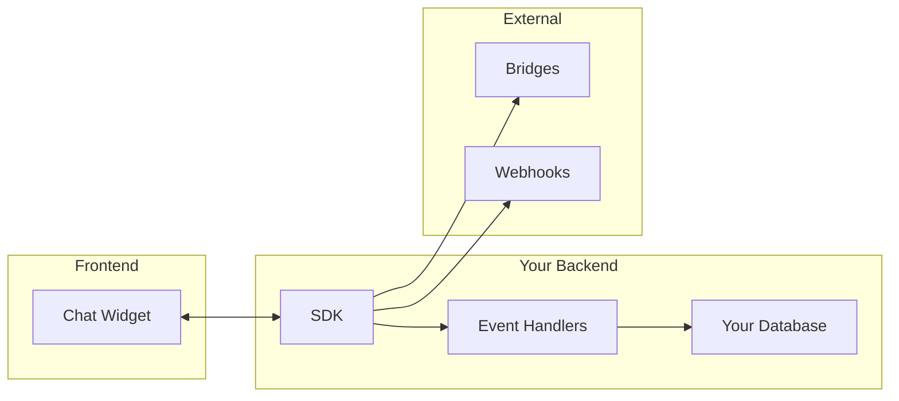
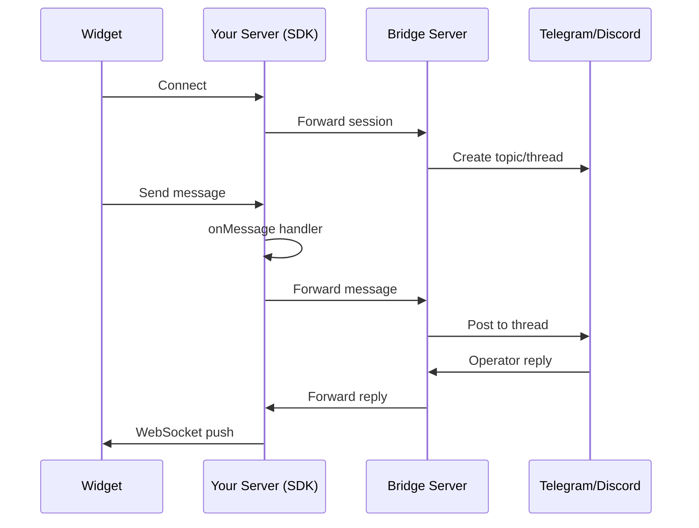

# Backend SDKs

Server-side SDKs for handling chat events, custom automation, and deep integrations.



## Available SDKs

| SDK | Language | Package |
|-----|----------|---------|
| [**Node.js**](./nodejs) | JavaScript/TypeScript | `@pocketping/sdk-node` |
| [**Python**](./python) | Python 3.10+ | `pocketping` |

## When to Use an SDK

| Use Case | SDK Needed? |
|----------|-------------|
| Basic chat widget | ❌ No - use SaaS or bridge-server only |
| Custom event tracking | ✅ Yes |
| User identification | ✅ Yes |
| Webhook forwarding | ✅ Yes (or bridge-server env var) |
| Custom automation | ✅ Yes |
| AI fallback | ✅ Yes |
| Custom storage | ✅ Yes |

## Core Features

### 1. Event Handling

React to widget events in your backend:

```javascript
const pp = new PocketPing({
  bridgeUrl: process.env.BRIDGE_URL,

  onSessionStart: (session) => {
    analytics.track('chat_started', { country: session.metadata.country });
  },

  onMessage: (message, session) => {
    if (message.content.includes('urgent')) {
      notifyTeam('Urgent message!', session.id);
    }
  },

  onEvent: (event, session) => {
    if (event.name === 'clicked_pricing') {
      crm.updateLead(session.visitorId, { interest: 'pricing' });
    }
  },
});
```

### 2. Custom Events

Trigger events from the widget and handle them server-side:

```javascript
// Widget (frontend)
PocketPing.trigger('viewed_pricing', { plan: 'pro' });

// SDK (backend)
pp.on('viewed_pricing', async (event, session) => {
  await analytics.track('pricing_view', event.data);

  // Send event back to widget
  await pp.emitEvent(session.id, 'show_discount', { percent: 10 });
});
```

### 3. Webhook Forwarding

Forward events to Zapier, Make, n8n, or custom endpoints:

```javascript
const pp = new PocketPing({
  bridgeUrl: process.env.BRIDGE_URL,
  webhookUrl: 'https://hooks.zapier.com/hooks/catch/123/abc',
  webhookSecret: 'whsec_xxx', // HMAC signature
});
```

### 4. User Identification

Enrich sessions with user data so operators can see who they're talking to:

```javascript
// After user logs in
await pp.handleIdentify({
  sessionId,
  identity: {
    id: user.id,                    // Required
    email: user.email,
    name: user.name,
    plan: user.subscription.plan,
    company: user.company.name,
  },
});
```

### 5. AI Fallback

Auto-respond when operators are away:

```javascript
const pp = new PocketPing({
  bridgeUrl: process.env.BRIDGE_URL,
  aiProvider: new OpenAIProvider({ apiKey: process.env.OPENAI_API_KEY }),
  aiTakeoverDelay: 300, // 5 minutes
  aiSystemPrompt: 'You are a helpful support assistant for Acme Inc...',
});
```

## Architecture



## Quick Start

import Tabs from '@theme/Tabs';
import TabItem from '@theme/TabItem';

<Tabs groupId="sdk-language">
<TabItem value="nodejs" label="Node.js" default>

```bash
npm install @pocketping/sdk-node
```

```javascript
const express = require('express');
const { PocketPing } = require('@pocketping/sdk-node');

const app = express();
const pp = new PocketPing({
  bridgeUrl: process.env.BRIDGE_URL,
});

app.use('/pocketping', pp.middleware());
app.listen(3000);
```

</TabItem>
<TabItem value="python" label="Python">

```bash
pip install pocketping
```

```python
from fastapi import FastAPI
from pocketping import PocketPing

app = FastAPI()
pp = PocketPing(bridge_url="http://localhost:3001")

pp.mount_fastapi(app, prefix="/pocketping")
```

</TabItem>
</Tabs>

## SDK vs Bridge Server

| Feature | SDK | Bridge Server Only |
|---------|-----|-------------------|
| Message routing | ✅ | ✅ |
| Event handlers | ✅ | ❌ |
| User identification | ✅ | ❌ |
| Custom automation | ✅ | ❌ |
| Webhook forwarding | ✅ | ✅ (via env var) |
| AI fallback | ✅ | ✅ (via env var) |
| Custom storage | ✅ | ❌ |

**Use SDK when:** You need custom logic, event handling, or deep integration.

**Use Bridge Server only when:** You just need basic chat → messaging platform routing.

## Next Steps

- [Node.js SDK](./nodejs) - Full documentation
- [Python SDK](./python) - Full documentation
- [Webhook Forwarding](/sdk/nodejs#webhook-forwarding) - Zapier, Make, n8n integration
- [Self-Hosting](/self-hosting) - Deploy your own backend
