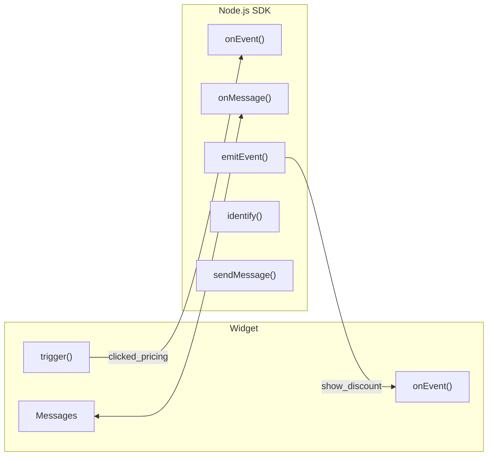
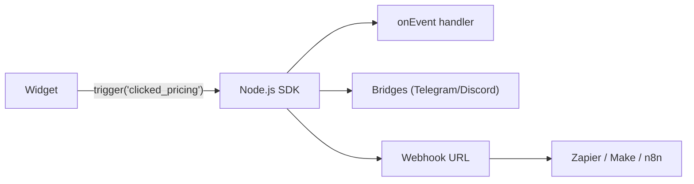
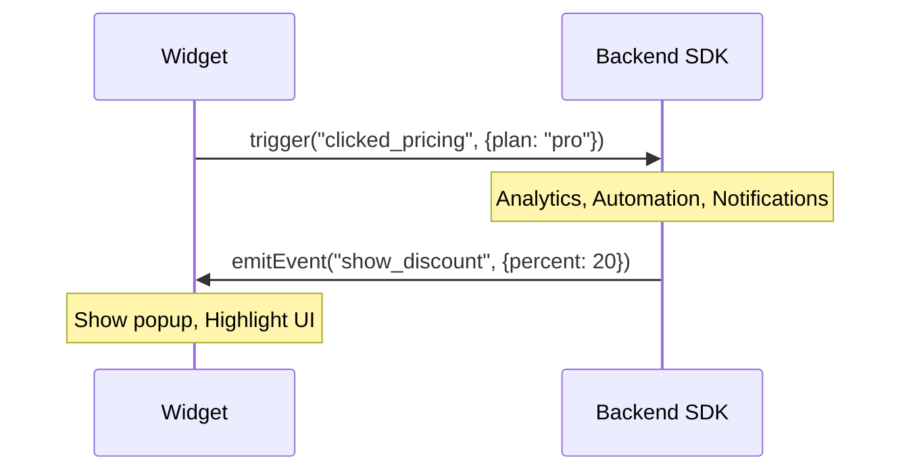

# Node.js SDK

Integrate PocketPing into your Node.js backend for custom event handling, analytics, and automation.



---

## Installation

```bash
# npm
npm install @pocketping/sdk-node

# yarn
yarn add @pocketping/sdk-node

# pnpm
pnpm add @pocketping/sdk-node
```

---

## Quick Start

### Express

```javascript
const express = require('express');
const { PocketPing } = require('@pocketping/sdk-node');

const app = express();

// Initialize PocketPing
const pp = new PocketPing({
  bridgeUrl: process.env.BRIDGE_URL || 'http://localhost:3001',
  apiKey: process.env.POCKETPING_API_KEY,
});

// Mount PocketPing middleware at /pocketping
app.use('/pocketping', pp.middleware());

app.listen(3000, () => {
  console.log('Server running on port 3000');
});
```

### Fastify

```javascript
const fastify = require('fastify')();
const { PocketPing } = require('@pocketping/sdk-node');

const pp = new PocketPing({
  bridgeUrl: process.env.BRIDGE_URL,
  apiKey: process.env.POCKETPING_API_KEY,
});

// Register as Fastify plugin
fastify.register(pp.fastifyPlugin, { prefix: '/pocketping' });

fastify.listen({ port: 3000 });
```

### Next.js (App Router)

```typescript title="app/api/pocketping/[...path]/route.ts"
import { PocketPing } from '@pocketping/sdk-node';

const pp = new PocketPing({
  bridgeUrl: process.env.BRIDGE_URL!,
  apiKey: process.env.POCKETPING_API_KEY,
});

export const GET = pp.nextHandler();
export const POST = pp.nextHandler();
```

### Next.js (Pages Router)

```typescript title="pages/api/pocketping/[...path].ts"
import { PocketPing } from '@pocketping/sdk-node';

const pp = new PocketPing({
  bridgeUrl: process.env.BRIDGE_URL!,
  apiKey: process.env.POCKETPING_API_KEY,
});

export default pp.nextPagesHandler();
```

---

## Configuration

```javascript
const pp = new PocketPing({
  // Required: URL of your bridge server
  bridgeUrl: 'http://localhost:3001',

  // Optional: API key for authentication
  apiKey: 'pk_xxxx',

  // Optional: Custom session storage (see Custom Storage section)
  storage: new RedisStorage(),

  // Optional: Event handlers (see below)
  onSessionStart: (session) => {},
  onMessage: (message, session) => {},
  onEvent: (event, session) => {},
});
```

### Configuration Options

| Option | Type | Required | Description |
|--------|------|----------|-------------|
| `bridgeUrl` | string | Yes | URL of your bridge server |
| `apiKey` | string | No | API key for authentication |
| `storage` | Storage | No | Custom session/message storage |
| `onSessionStart` | function | No | Called when new session starts |
| `onMessage` | function | No | Called on each message |
| `onEvent` | function | No | Called on custom events from widget |
| `webhookUrl` | string | No | URL to forward custom events (Zapier, Make, n8n, etc.) |
| `webhookSecret` | string | No | Secret for HMAC-SHA256 signature verification |
| `webhookTimeout` | number | No | Webhook request timeout in ms (default: 5000) |

---

## Webhook Forwarding

Forward custom events to external services like Zapier, Make, n8n, or your own backend for automation.



### Basic Setup

```javascript
const pp = new PocketPing({
  bridgeUrl: process.env.BRIDGE_URL,

  // Forward all custom events to your webhook
  webhookUrl: 'https://hooks.zapier.com/hooks/catch/123456/abcdef',
});
```

### With HMAC Signature

For security, add a webhook secret to verify requests:

```javascript
const pp = new PocketPing({
  bridgeUrl: process.env.BRIDGE_URL,
  webhookUrl: 'https://your-backend.com/pocketping/events',
  webhookSecret: process.env.WEBHOOK_SECRET,  // e.g., 'whsec_xxx'
  webhookTimeout: 10000,  // 10 seconds (default: 5000)
});
```

### Webhook Payload

Every event is sent as a POST request with this JSON body:

```json
{
  "event": {
    "name": "clicked_pricing",
    "data": { "plan": "pro", "source": "homepage" },
    "timestamp": "2026-01-21T12:00:00.000Z",
    "sessionId": "sess_abc123"
  },
  "session": {
    "id": "sess_abc123",
    "visitorId": "visitor_xyz",
    "metadata": {
      "url": "https://example.com/pricing",
      "country": "France",
      "browser": "Chrome",
      "deviceType": "desktop"
    }
  },
  "sentAt": "2026-01-21T12:00:00.123Z"
}
```

### Verifying Signatures

If `webhookSecret` is set, requests include `X-PocketPing-Signature` header:

```javascript
// Your webhook endpoint
app.post('/pocketping/events', (req, res) => {
  const signature = req.headers['x-pocketping-signature'];
  const body = JSON.stringify(req.body);

  // Verify signature
  const crypto = require('crypto');
  const expected = 'sha256=' + crypto
    .createHmac('sha256', process.env.WEBHOOK_SECRET)
    .update(body)
    .digest('hex');

  if (signature !== expected) {
    return res.status(401).json({ error: 'Invalid signature' });
  }

  // Process the event
  const { event, session } = req.body;
  console.log(`Event: ${event.name} from ${session.metadata.country}`);

  res.json({ ok: true });
});
```

### Use Cases

| Integration | Example |
|-------------|---------|
| **Zapier** | Create CRM lead when `form_submitted` |
| **Make (Integromat)** | Send Slack message when `clicked_pricing` |
| **n8n** | Update Airtable when `started_trial` |
| **Custom Backend** | Log analytics, trigger emails, sync to data warehouse |

---

## Custom Events

**The most powerful feature of the SDK.** Handle events from the widget and send events back.

### Event Flow Overview



### Receiving Events from Widget

Handle events sent by `PocketPing.trigger()` in the widget:

```javascript
const pp = new PocketPing({
  bridgeUrl: process.env.BRIDGE_URL,

  onEvent: async (event, session) => {
    console.log(`Event: ${event.name}`, event.data);
    console.log(`From session: ${session.id}`);

    // Example: Track in analytics
    analytics.track(event.name, {
      ...event.data,
      sessionId: session.id,
      visitorId: session.visitorId,
    });

    // Example: Trigger automation based on event
    if (event.name === 'clicked_pricing') {
      // Wait 5 seconds, then send a message
      setTimeout(() => {
        pp.sendMessage(session.id, {
          content: "I see you're checking out our pricing! Want help choosing a plan?",
          type: 'operator',
        });
      }, 5000);
    }

    // Example: Notify team in Slack
    if (event.name === 'requested_demo') {
      await notifySlack(`New demo request from ${session.metadata?.email}`);
    }
  },
});
```

### Event Object Structure

```typescript
interface CustomEvent {
  name: string;           // Event name (e.g., 'clicked_pricing')
  data: Record<string, unknown>;  // Event payload
  timestamp: string;      // ISO timestamp
  sessionId: string;      // Session that triggered it
}

interface Session {
  id: string;
  visitorId: string;
  projectId: string;
  metadata: {
    url: string;
    country: string;
    browser: string;
    device: string;
    // Plus any data from identify()
  };
  status: 'active' | 'closed';
  createdAt: string;
  lastActivity: string;
}
```

### Sending Events to Widget

Use `emitEvent()` to send events the widget can react to:

```javascript
// Show a discount popup
await pp.emitEvent(sessionId, 'show_discount', {
  percent: 20,
  code: 'SAVE20',
  message: 'Special offer just for you!',
});

// Open the chat widget programmatically
await pp.emitEvent(sessionId, 'open_chat');

// Highlight a UI element
await pp.emitEvent(sessionId, 'highlight', {
  selector: '#pricing-section',
  message: 'Check out our new pricing!',
});

// Show a notification
await pp.emitEvent(sessionId, 'notification', {
  title: 'New feature!',
  body: 'We just launched dark mode.',
});
```

The widget listens for these with `PocketPing.onEvent()`:

```javascript
// In the browser
PocketPing.onEvent('show_discount', (data) => {
  showDiscountModal(data);
});
```

---

## Session & Message APIs

### Working with Sessions

```javascript
// Get all active sessions
const sessions = await pp.getSessions();
console.log(`${sessions.length} active conversations`);

// Get a specific session
const session = await pp.getSession('sess_abc123');
console.log(`Session from ${session.metadata.country}`);

// Get session messages
const messages = await pp.getMessages('sess_abc123');
messages.forEach(msg => {
  console.log(`[${msg.sender.type}] ${msg.content}`);
});

// Close a session
await pp.closeSession('sess_abc123');
```

### Sending Messages

```javascript
// Send a message to a session
await pp.sendMessage('sess_abc123', {
  content: 'Hello from the backend!',
  type: 'operator',  // 'operator' | 'system'
});

// Send with custom sender name
await pp.sendMessage('sess_abc123', {
  content: 'Your order has shipped!',
  type: 'system',
  senderName: 'Order Bot',
});
```

### Identifying Visitors

Enrich session data with visitor information:

```javascript
// After user logs in on your site
await pp.identify('sess_abc123', {
  email: 'john@example.com',
  name: 'John Doe',
  userId: 'user_12345',
  // Any custom properties
  plan: 'pro',
  company: 'Acme Inc',
  mrr: 99,
});
```

This data appears in your messaging platform and enables personalized automation.

---

## Event Handlers

### onSessionStart

Called when a new conversation starts:

```javascript
const pp = new PocketPing({
  bridgeUrl: process.env.BRIDGE_URL,

  onSessionStart: async (session) => {
    console.log(`New session: ${session.id}`);
    console.log(`From: ${session.metadata.country}`);
    console.log(`Page: ${session.metadata.url}`);

    // Log to analytics
    analytics.track('chat_started', {
      sessionId: session.id,
      page: session.metadata.url,
    });

    // Send welcome based on page
    if (session.metadata.url.includes('/pricing')) {
      await pp.sendMessage(session.id, {
        content: "Hi! Looking at our pricing? I'd love to help you find the right plan.",
        type: 'operator',
      });
    }
  },
});
```

### onMessage

Called on every message (sent and received):

```javascript
const pp = new PocketPing({
  bridgeUrl: process.env.BRIDGE_URL,

  onMessage: async (message, session) => {
    console.log(`[${message.direction}] ${message.content}`);

    // Log all messages for compliance
    await logMessage({
      sessionId: session.id,
      content: message.content,
      direction: message.direction,
      timestamp: message.timestamp,
    });

    // Keyword detection
    if (message.direction === 'inbound') {
      const lowerContent = message.content.toLowerCase();

      if (lowerContent.includes('urgent') || lowerContent.includes('emergency')) {
        await notifyTeam('Urgent message received!', session.id);
      }

      if (lowerContent.includes('cancel') || lowerContent.includes('refund')) {
        await pp.sendMessage(session.id, {
          content: "I'll connect you with our billing team right away.",
          type: 'system',
        });
        await escalateToSupport(session.id);
      }
    }
  },
});
```

---

## Complete Example

```javascript
const express = require('express');
const { PocketPing } = require('@pocketping/sdk-node');

const app = express();

const pp = new PocketPing({
  bridgeUrl: process.env.BRIDGE_URL,
  apiKey: process.env.POCKETPING_API_KEY,

  // New session started
  onSessionStart: async (session) => {
    console.log(`New chat from ${session.metadata.country}`);

    // Track in analytics
    analytics.track('chat_started', {
      sessionId: session.id,
      country: session.metadata.country,
      page: session.metadata.url,
    });
  },

  // Message received
  onMessage: async (message, session) => {
    if (message.direction === 'inbound') {
      analytics.track('message_received', {
        sessionId: session.id,
        wordCount: message.content.split(' ').length,
      });
    }
  },

  // Custom events from widget
  onEvent: async (event, session) => {
    console.log(`Event: ${event.name}`, event.data);

    switch (event.name) {
      case 'clicked_pricing':
        // Track high-intent action
        analytics.track('pricing_interest', {
          plan: event.data.plan,
          sessionId: session.id,
        });

        // If they look at enterprise, notify sales
        if (event.data.plan === 'enterprise') {
          await notifySales(session);
        }
        break;

      case 'started_trial':
        // Update CRM
        await crm.updateLead(session.visitorId, {
          status: 'trial',
          trialStarted: new Date(),
        });
        break;

      case 'form_submitted':
        // Send confirmation
        await pp.emitEvent(session.id, 'show_toast', {
          message: 'Thanks! We received your submission.',
        });
        break;
    }
  },
});

// Mount middleware
app.use('/pocketping', pp.middleware());

// Your other routes
app.get('/api/support/sessions', async (req, res) => {
  const sessions = await pp.getSessions();
  res.json({ sessions });
});

app.post('/api/support/sessions/:id/message', async (req, res) => {
  await pp.sendMessage(req.params.id, {
    content: req.body.message,
    type: 'operator',
  });
  res.json({ success: true });
});

app.listen(3000);
```

---

## Custom Storage

By default, the SDK uses in-memory storage. For production, implement the `Storage` interface:

```typescript
import { Storage, Session, Message } from '@pocketping/sdk-node';
import Redis from 'ioredis';

class RedisStorage implements Storage {
  constructor(private redis: Redis) {}

  async createSession(session: Session): Promise<void> {
    await this.redis.hset(
      `pocketping:session:${session.id}`,
      session
    );
  }

  async getSession(id: string): Promise<Session | null> {
    const data = await this.redis.hgetall(`pocketping:session:${id}`);
    return data.id ? data as Session : null;
  }

  async updateSession(id: string, updates: Partial<Session>): Promise<void> {
    await this.redis.hset(`pocketping:session:${id}`, updates);
  }

  async saveMessage(sessionId: string, message: Message): Promise<void> {
    await this.redis.rpush(
      `pocketping:messages:${sessionId}`,
      JSON.stringify(message)
    );
  }

  async getMessages(sessionId: string): Promise<Message[]> {
    const messages = await this.redis.lrange(
      `pocketping:messages:${sessionId}`,
      0, -1
    );
    return messages.map(m => JSON.parse(m));
  }

  async deleteSession(id: string): Promise<void> {
    await this.redis.del(`pocketping:session:${id}`);
    await this.redis.del(`pocketping:messages:${id}`);
  }
}

// Use it
const pp = new PocketPing({
  bridgeUrl: process.env.BRIDGE_URL,
  storage: new RedisStorage(new Redis(process.env.REDIS_URL)),
});
```

---

## TypeScript Support

The SDK includes full TypeScript definitions:

```typescript
import {
  PocketPing,
  PocketPingConfig,
  Session,
  Message,
  CustomEvent,
  Storage,
} from '@pocketping/sdk-node';

const config: PocketPingConfig = {
  bridgeUrl: process.env.BRIDGE_URL!,
  apiKey: process.env.POCKETPING_API_KEY,

  onEvent: (event: CustomEvent, session: Session) => {
    // Fully typed
    console.log(event.name, event.data);
    console.log(session.id, session.metadata.country);
  },
};

const pp = new PocketPing(config);
```

---

## API Reference

### Methods

| Method | Description |
|--------|-------------|
| `pp.middleware()` | Express middleware |
| `pp.fastifyPlugin` | Fastify plugin |
| `pp.nextHandler()` | Next.js App Router handler |
| `pp.nextPagesHandler()` | Next.js Pages Router handler |
| `pp.getSessions()` | Get all active sessions |
| `pp.getSession(id)` | Get a specific session |
| `pp.getMessages(sessionId)` | Get session messages |
| `pp.sendMessage(sessionId, message)` | Send a message |
| `pp.emitEvent(sessionId, event, data)` | Send event to widget |
| `pp.identify(sessionId, data)` | Identify visitor |
| `pp.closeSession(sessionId)` | Close a session |

---

## Next Steps

- **[Python SDK](/sdk/python)** - Backend integration for Python
- **[Widget Configuration](/widget/configuration)** - Configure the frontend widget
- **[Custom Events](/widget/configuration#custom-events)** - Frontend event handling
- **[AI Fallback](/ai-fallback)** - Auto-respond when away
