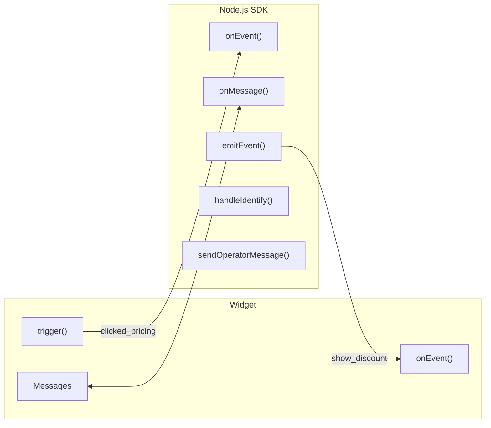
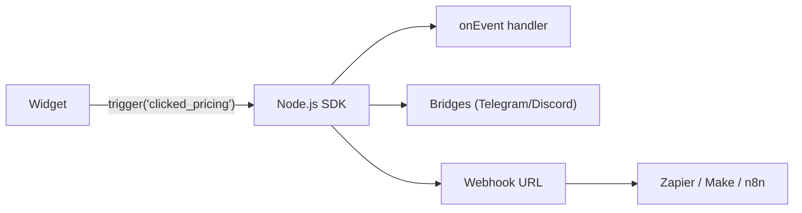
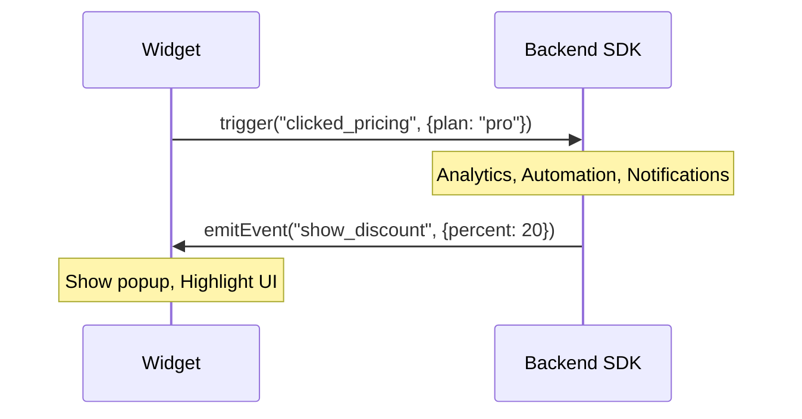

# Node.js SDK

Integrate PocketPing into your Node.js backend for custom event handling, analytics, and automation.


```mermaid
flowchart LR
    subgraph widget["Widget"]
        trigger["trigger()"]
        listen["onEvent()"]
        msgs["Messages"]
    end

    subgraph sdk["Node.js SDK"]
        onEvent["onEvent()"]
        onMessage["onMessage()"]
        emitEvent["emitEvent()"]
        identify["handleIdentify()"]
        sendOp["sendOperatorMessage()"]
    end

    trigger -->|"clicked_pricing"| onEvent
    msgs <--> onMessage
    emitEvent -->|"show_discount"| listen
```

---

## Installation

```bash
# npm
npm install @pocketping/sdk-node

# yarn
yarn add @pocketping/sdk-node

# pnpm
pnpm add @pocketping/sdk-node
```

---

## Quick Start

### Express

```javascript
const express = require('express');
const http = require('node:http');
const { PocketPing } = require('@pocketping/sdk-node');

const app = express();
app.use(express.json());

// Initialize PocketPing
const pp = new PocketPing({
  welcomeMessage: 'Hi! How can we help?',
});

// Mount the PocketPing request handler at /pocketping
// It handles /pocketping/connect, /message, /messages, etc.
app.use('/pocketping', pp.middleware());

// Attach the WebSocket server for real-time streaming (/pocketping/stream)
const server = http.createServer(app);
pp.attachWebSocket(server);

server.listen(3000, () => {
  console.log('Server running on port 3000');
});
```

The `middleware()` returns a standard Node `(req, res, next)` handler, so it also works with raw `http`/Connect servers and any framework that accepts Connect-style middleware.

### Next.js (App Router)

`middleware()` is a Node request handler, so wrap it to adapt the App Router's
Web `Request`/`Response`. A long-running server (not serverless) is required for
the WebSocket stream.

```typescript title="app/api/pocketping/[...path]/route.ts"
import { PocketPing } from '@pocketping/sdk-node';

const pp = new PocketPing({
  welcomeMessage: 'Hi! How can we help?',
});

// Receive an event from the widget and react to it
pp.onEvent('clicked_pricing', async (event, session) => {
  console.log(`Pricing interest from ${session.id}`, event.data);
});
```

---

## Built-in Bridges

The SDK includes built-in bridges for Telegram, Discord, and Slack. No external libraries required - all communication uses HTTP APIs directly.

```javascript
import { PocketPing, TelegramBridge, DiscordBridge, SlackBridge } from '@pocketping/sdk-node';

const pp = new PocketPing({ /* ... */ });

// Add Telegram bridge
pp.addBridge(new TelegramBridge({
  botToken: process.env.TELEGRAM_BOT_TOKEN,
  chatIds: process.env.TELEGRAM_CHAT_ID,
}));

// Add Discord bridge (bot mode for bidirectional)
pp.addBridge(DiscordBridge.bot(
  process.env.DISCORD_BOT_TOKEN,
  process.env.DISCORD_CHANNEL_ID
));

// Add Slack bridge (webhook mode for simple notifications)
pp.addBridge(SlackBridge.webhook(
  process.env.SLACK_WEBHOOK_URL
));
```

:::tip Multiple bridges
You can add multiple bridges simultaneously. Messages sync across all platforms.
:::

:::warning Discord requires long-running server
**Discord bot mode** uses the Discord Gateway (WebSocket) to receive operator replies. This only works on **long-running servers** (Express, Fastify, etc.).

**Does NOT work with:**
- Vercel Functions
- AWS Lambda
- Cloudflare Workers
- Any serverless environment

**For serverless + Discord bidirectional:** Use the [Bridge Server](/bridges/docker) instead, or use `DiscordBridge.webhook(url)` (send-only).
:::

:::info Telegram & Slack work with serverless
**Telegram** and **Slack** use HTTP webhooks (not WebSocket), so they work fully with serverless environments like Vercel, Lambda, etc.
:::

---

## Configuration

```javascript
const pp = new PocketPing({
  // Optional: welcome message returned to new visitors on connect
  welcomeMessage: 'Hi! How can we help?',

  // Optional: built-in bridges (Telegram, Discord, Slack)
  bridges: [],

  // Optional: Custom session storage (see Custom Storage section)
  storage: new RedisStorage(),

  // Optional: Event handlers (see below)
  onNewSession: (session) => {},
  onMessage: (message, session) => {},
  onEvent: (event, session) => {},
  onIdentify: (session) => {},
});
```

### Configuration Options

| Option | Type | Required | Description |
|--------|------|----------|-------------|
| `storage` | Storage \| `'memory'` | No | Custom session/message storage (defaults to in-memory) |
| `bridges` | Bridge[] | No | Built-in bridges (Telegram/Discord/Slack) |
| `welcomeMessage` | string | No | Message returned to new visitors on connect |
| `onNewSession` | function | No | Called when a new session starts |
| `onMessage` | function | No | Called on each message |
| `onEvent` | function | No | Called on custom events from the widget |
| `onIdentify` | function | No | Called when a visitor is identified |
| `onVisitorDisconnect` | function | No | Called when a visitor disconnects |
| `webhookUrl` | string | No | URL to forward custom events (Zapier, Make, n8n, etc.) |
| `webhookSecret` | string | No | Secret for HMAC-SHA256 signature verification |
| `webhookTimeout` | number | No | Webhook request timeout in ms (default: 5000) |
| `ai` | AIConfig | No | AI fallback provider (see [AI Fallback](/ai-fallback)) |
| `aiTakeoverDelay` | number | No | Seconds offline before AI takes over (default: 300) |

---

## Webhook Forwarding

Forward custom events to external services like Zapier, Make, n8n, or your own backend for automation.


```mermaid
flowchart LR
    W["Widget"] -->|"trigger('clicked_pricing')"| SDK["Node.js SDK"]
    SDK --> H["onEvent handler"]
    SDK --> B["Bridges (Telegram/Discord)"]
    SDK --> WH["Webhook URL"]
    WH --> Z["Zapier / Make / n8n"]
```

### Basic Setup

```javascript
const pp = new PocketPing({
  // Forward all custom events to your webhook
  webhookUrl: 'https://hooks.zapier.com/hooks/catch/123456/abcdef',
});
```

### With HMAC Signature

For security, add a webhook secret to verify requests:

```javascript
const pp = new PocketPing({
  webhookUrl: 'https://your-backend.com/pocketping/events',
  webhookSecret: process.env.WEBHOOK_SECRET,  // e.g., 'whsec_xxx'
  webhookTimeout: 10000,  // 10 seconds (default: 5000)
});
```

### Webhook Payload

Every event is sent as a POST request with this JSON body:

```json
{
  "event": {
    "name": "clicked_pricing",
    "data": { "plan": "pro", "source": "homepage" },
    "timestamp": "2026-01-21T12:00:00.000Z",
    "sessionId": "sess_abc123"
  },
  "session": {
    "id": "sess_abc123",
    "visitorId": "visitor_xyz",
    "metadata": {
      "url": "https://example.com/pricing",
      "country": "France",
      "browser": "Chrome",
      "deviceType": "desktop"
    }
  },
  "sentAt": "2026-01-21T12:00:00.123Z"
}
```

### Verifying Signatures

If `webhookSecret` is set, requests include `X-PocketPing-Signature` header:

```javascript
// Your webhook endpoint
app.post('/pocketping/events', (req, res) => {
  const signature = req.headers['x-pocketping-signature'];
  const body = JSON.stringify(req.body);

  // Verify signature
  const crypto = require('crypto');
  const expected = 'sha256=' + crypto
    .createHmac('sha256', process.env.WEBHOOK_SECRET)
    .update(body)
    .digest('hex');

  if (signature !== expected) {
    return res.status(401).json({ error: 'Invalid signature' });
  }

  // Process the event
  const { event, session } = req.body;
  console.log(`Event: ${event.name} from ${session.metadata.country}`);

  res.json({ ok: true });
});
```

### Use Cases

| Integration | Example |
|-------------|---------|
| **Zapier** | Create CRM lead when `form_submitted` |
| **Make (Integromat)** | Send Slack message when `clicked_pricing` |
| **n8n** | Update Airtable when `started_trial` |
| **Custom Backend** | Log analytics, trigger emails, sync to data warehouse |

---

## Custom Events

**The most powerful feature of the SDK.** Handle events from the widget and send events back.

### Event Flow Overview


```mermaid
sequenceDiagram
    participant W as Widget
    participant B as Backend SDK

    W->>B: trigger("clicked_pricing", {plan: "pro"})
    Note over B: Analytics, Automation, Notifications

    B->>W: emitEvent("show_discount", {percent: 20})
    Note over W: Show popup, Highlight UI
```

### Receiving Events from Widget

Handle events sent by `PocketPing.trigger()` in the widget:

```javascript
const pp = new PocketPing({
  onEvent: async (event, session) => {
    console.log(`Event: ${event.name}`, event.data);
    console.log(`From session: ${session.id}`);

    // Example: Track in analytics
    analytics.track(event.name, {
      ...event.data,
      sessionId: session.id,
      visitorId: session.visitorId,
    });

    // Example: Trigger automation based on event
    if (event.name === 'clicked_pricing') {
      // Wait 5 seconds, then send an operator message
      setTimeout(() => {
        pp.sendOperatorMessage(
          session.id,
          "I see you're checking out our pricing! Want help choosing a plan?"
        );
      }, 5000);
    }

    // Example: Notify team in Slack
    if (event.name === 'requested_demo') {
      await notifySlack(`New demo request from ${session.identity?.email}`);
    }
  },
});
```

### Event Object Structure

```typescript
interface CustomEvent {
  name: string;                    // Event name (e.g., 'clicked_pricing')
  data?: Record<string, unknown>;  // Event payload
  timestamp: string;               // ISO timestamp
  sessionId?: string;              // Session that triggered it
}

interface Session {
  id: string;
  visitorId: string;
  createdAt: Date;
  lastActivity: Date;
  operatorOnline: boolean;
  aiActive: boolean;
  metadata?: {
    url?: string;
    country?: string;
    browser?: string;
    deviceType?: 'desktop' | 'mobile' | 'tablet';
    // ...plus other page/client/geo fields
  };
  identity?: {
    id: string;       // set after PocketPing.identify()
    email?: string;
    name?: string;
    [key: string]: unknown;
  };
}
```

### Sending Events to Widget

Use `emitEvent()` to send events the widget can react to:

```javascript
// Show a discount popup
await pp.emitEvent(sessionId, 'show_discount', {
  percent: 20,
  code: 'SAVE20',
  message: 'Special offer just for you!',
});

// Open the chat widget programmatically
await pp.emitEvent(sessionId, 'open_chat');

// Highlight a UI element
await pp.emitEvent(sessionId, 'highlight', {
  selector: '#pricing-section',
  message: 'Check out our new pricing!',
});

// Show a notification
await pp.emitEvent(sessionId, 'notification', {
  title: 'New feature!',
  body: 'We just launched dark mode.',
});
```

The widget listens for these with `PocketPing.onEvent()`:

```javascript
// In the browser
PocketPing.onEvent('show_discount', (data) => {
  showDiscountModal(data);
});
```

---

## Session & Message APIs

### Working with Sessions

```javascript
// Get a specific session
const session = await pp.getSession('sess_abc123');
if (session) {
  console.log(`Session from ${session.metadata?.country}`);
}

// Get session messages (paginated; returns { messages, hasMore })
const { messages, hasMore } = await pp.handleGetMessages({
  sessionId: 'sess_abc123',
  limit: 50,        // optional, max 100
  // after: 'msg_id' // optional cursor for pagination
});
messages.forEach((msg) => {
  console.log(`[${msg.sender}] ${msg.content}`);
});
```

:::note Sessions live in your storage
The SDK does not keep an in-memory list of "all sessions". To enumerate
conversations, query your `Storage` implementation directly (e.g. via
`pp.getStorage()` or your own DB), or track sessions in `onNewSession`.
:::

### Sending Messages

Send a reply as the operator. `sendOperatorMessage(sessionId, content)` persists
the message, broadcasts it to the widget over WebSocket, and syncs it to your
bridges (Telegram/Discord/Slack).

```javascript
// Send an operator message to a session
await pp.sendOperatorMessage(
  'sess_abc123',
  'Hello from the backend!'
);
```

For lower-level control you can also call `handleMessage()` directly with a
full `SendMessageRequest` (`{ sessionId, content, sender }`).

### Identifying Visitors

Enrich session data with visitor information so operators can see who they're talking to:

```javascript
// After user logs in on your site
await pp.handleIdentify({
  sessionId: 'sess_abc123',
  identity: {
    id: 'user_12345',           // Required - unique user identifier
    email: 'john@example.com',
    name: 'John Doe',
    // Any custom properties
    plan: 'pro',
    company: 'Acme Inc',
    mrr: 99,
  },
});
```

**Required field:** `identity.id` must be a non-empty string (typically your user's database ID).

You can also pass identity during connection:

```javascript
const session = await pp.handleConnect({
  visitorId: 'visitor-xyz',
  identity: {
    id: 'user_12345',
    email: 'john@example.com',
    name: 'John Doe',
  },
});
```

This data appears in your messaging platform (Telegram/Discord/Slack) and enables personalized automation.

---

## Event Handlers

### onNewSession

Called when a new conversation starts:

```javascript
const pp = new PocketPing({
  onNewSession: async (session) => {
    console.log(`New session: ${session.id}`);
    console.log(`From: ${session.metadata?.country}`);
    console.log(`Page: ${session.metadata?.url}`);

    // Log to analytics
    analytics.track('chat_started', {
      sessionId: session.id,
      page: session.metadata?.url,
    });

    // Send welcome based on page
    if (session.metadata?.url?.includes('/pricing')) {
      await pp.sendOperatorMessage(
        session.id,
        "Hi! Looking at our pricing? I'd love to help you find the right plan."
      );
    }
  },
});
```

### onMessage

Called on every message (visitor, operator, and AI):

```javascript
const pp = new PocketPing({
  onMessage: async (message, session) => {
    console.log(`[${message.sender}] ${message.content}`);

    // Log all messages for compliance
    await logMessage({
      sessionId: session.id,
      content: message.content,
      sender: message.sender,        // 'visitor' | 'operator' | 'ai'
      timestamp: message.timestamp,
    });

    // Keyword detection on visitor messages
    if (message.sender === 'visitor') {
      const lowerContent = message.content.toLowerCase();

      if (lowerContent.includes('urgent') || lowerContent.includes('emergency')) {
        await notifyTeam('Urgent message received!', session.id);
      }

      if (lowerContent.includes('cancel') || lowerContent.includes('refund')) {
        await pp.sendOperatorMessage(
          session.id,
          "I'll connect you with our billing team right away."
        );
        await escalateToSupport(session.id);
      }
    }
  },
});
```

---

## Complete Example

```javascript
const express = require('express');
const http = require('node:http');
const { PocketPing } = require('@pocketping/sdk-node');

const app = express();
app.use(express.json());

const pp = new PocketPing({
  welcomeMessage: 'Hi! How can we help?',

  // New session started
  onNewSession: async (session) => {
    console.log(`New chat from ${session.metadata?.country}`);

    // Track in analytics
    analytics.track('chat_started', {
      sessionId: session.id,
      country: session.metadata?.country,
      page: session.metadata?.url,
    });
  },

  // Message received
  onMessage: async (message, session) => {
    if (message.sender === 'visitor') {
      analytics.track('message_received', {
        sessionId: session.id,
        wordCount: message.content.split(' ').length,
      });
    }
  },

  // Custom events from widget
  onEvent: async (event, session) => {
    console.log(`Event: ${event.name}`, event.data);

    switch (event.name) {
      case 'clicked_pricing':
        // Track high-intent action
        analytics.track('pricing_interest', {
          plan: event.data.plan,
          sessionId: session.id,
        });

        // If they look at enterprise, notify sales
        if (event.data.plan === 'enterprise') {
          await notifySales(session);
        }
        break;

      case 'started_trial':
        // Update CRM
        await crm.updateLead(session.visitorId, {
          status: 'trial',
          trialStarted: new Date(),
        });
        break;

      case 'form_submitted':
        // Send confirmation
        await pp.emitEvent(session.id, 'show_toast', {
          message: 'Thanks! We received your submission.',
        });
        break;
    }
  },
});

// Mount middleware + WebSocket stream
app.use('/pocketping', pp.middleware());
const server = http.createServer(app);
pp.attachWebSocket(server);

// Your other routes
app.get('/api/support/sessions/:id', async (req, res) => {
  const session = await pp.getSession(req.params.id);
  res.json({ session });
});

app.post('/api/support/sessions/:id/message', async (req, res) => {
  await pp.sendOperatorMessage(req.params.id, req.body.message);
  res.json({ success: true });
});

server.listen(3000);
```

---

## Custom Storage

By default, the SDK uses in-memory storage. For production, implement the `Storage` interface:

```typescript
import { Storage, Session, Message } from '@pocketping/sdk-node';
import Redis from 'ioredis';

class RedisStorage implements Storage {
  constructor(private redis: Redis) {}

  async createSession(session: Session): Promise<void> {
    await this.redis.set(
      `pocketping:session:${session.id}`,
      JSON.stringify(session)
    );
  }

  async getSession(sessionId: string): Promise<Session | null> {
    const data = await this.redis.get(`pocketping:session:${sessionId}`);
    return data ? (JSON.parse(data) as Session) : null;
  }

  // The SDK passes the full, updated Session object
  async updateSession(session: Session): Promise<void> {
    await this.redis.set(
      `pocketping:session:${session.id}`,
      JSON.stringify(session)
    );
  }

  async deleteSession(sessionId: string): Promise<void> {
    await this.redis.del(`pocketping:session:${sessionId}`);
    await this.redis.del(`pocketping:messages:${sessionId}`);
  }

  async saveMessage(message: Message): Promise<void> {
    await this.redis.rpush(
      `pocketping:messages:${message.sessionId}`,
      JSON.stringify(message)
    );
  }

  async getMessages(sessionId: string): Promise<Message[]> {
    const messages = await this.redis.lrange(
      `pocketping:messages:${sessionId}`,
      0, -1
    );
    return messages.map((m) => JSON.parse(m));
  }

  async getMessage(messageId: string): Promise<Message | null> {
    // Scan or maintain a secondary index; simplified here
    return null;
  }
}

// Use it
const pp = new PocketPing({
  storage: new RedisStorage(new Redis(process.env.REDIS_URL)),
});
```

:::note Required vs optional methods
`createSession`, `getSession`, `updateSession`, `deleteSession`, `saveMessage`,
`getMessages`, and `getMessage` are required. Methods for bridge message IDs and
attachments (`saveAttachment`, `getAttachment`, `updateAttachment`,
`saveBridgeMessageIds`, `getBridgeMessageIds`) are optional — implement them to
enable edit/delete-to-bridge sync and file attachments.
:::

---

## TypeScript Support

The SDK includes full TypeScript definitions:

```typescript
import {
  PocketPing,
  PocketPingConfig,
  Session,
  Message,
  CustomEvent,
  Storage,
} from '@pocketping/sdk-node';

const config: PocketPingConfig = {
  welcomeMessage: 'Hi! How can we help?',

  onEvent: (event: CustomEvent, session: Session) => {
    // Fully typed
    console.log(event.name, event.data);
    console.log(session.id, session.metadata?.country);
  },
};

const pp = new PocketPing(config);
```

---

## API Reference

### Methods

| Method | Description |
|--------|-------------|
| `pp.middleware()` | Returns a Node/Connect/Express request handler |
| `pp.attachWebSocket(server)` | Attach the WebSocket stream to an HTTP server |
| `pp.handleConnect(request)` | Handle a widget connection |
| `pp.handleMessage(request)` | Handle a message (`{ sessionId, content, sender }`) |
| `pp.handleGetMessages(request)` | Get session messages (`{ messages, hasMore }`) |
| `pp.handleEditMessage(request)` | Edit a visitor message (synced to bridges) |
| `pp.handleDeleteMessage(request)` | Delete a visitor message (synced to bridges) |
| `pp.handleRead(request)` | Update delivered/read status |
| `pp.handleIdentify({ sessionId, identity })` | Identify a visitor |
| `pp.handlePresence()` | Get operator presence + AI status |
| `pp.handleUploadRequest(request)` | Request a presigned upload URL |
| `pp.handleUploadComplete(attachmentId)` | Mark an attachment ready |
| `pp.getSession(id)` | Get a specific session |
| `pp.sendOperatorMessage(sessionId, content)` | Send an operator reply |
| `pp.setOperatorOnline(online)` | Set operator online/offline |
| `pp.emitEvent(sessionId, event, data)` | Send a custom event to one widget |
| `pp.broadcastEvent(event, data)` | Send a custom event to all widgets |
| `pp.triggerEvent(sessionId, event, data)` | Process an event server-side |
| `pp.onEvent(name, handler)` | Subscribe to custom events (`'*'` for all) |
| `pp.addBridge(bridge)` | Add a bridge at runtime |
| `pp.getStorage()` | Access the underlying storage adapter |

---

## User-Agent Filtering

Block bots and automated requests from creating chat sessions to prevent spam and reduce noise.

### Quick Setup

```javascript
const pp = new PocketPing({
  uaFilter: {
    enabled: true,
    // Automatically blocks ~50 known bot patterns (GoogleBot, curl, etc.)
    useDefaultBots: true,
  },
});
```

### Configuration Options

```javascript
const pp = new PocketPing({
  uaFilter: {
    enabled: true,
    mode: 'blocklist',  // 'blocklist' | 'allowlist' | 'both'
    useDefaultBots: true,  // Include ~50 default bot patterns
    blocklist: [
      'my-custom-scraper',
      'bad-bot',
      '/spam-\\d+/',  // Regex pattern
    ],
    allowlist: [
      'my-monitoring-bot',
      '/internal-.*/',  // Regex: allow internal tools
    ],
    logBlocked: true,
    blockedStatusCode: 403,
    blockedMessage: 'Forbidden',
  },
});
```

### Filter Modes

| Mode | Behavior |
|------|----------|
| `blocklist` | Block matching user-agents, allow all others |
| `allowlist` | Only allow matching user-agents, block all others |
| `both` | Allowlist takes precedence, then blocklist is applied |

### Pattern Types

- **Substring**: `googlebot` matches any UA containing "googlebot" (case-insensitive)
- **Regex**: `/bot-\d+/` - wrap pattern in `/` for regex matching

### Default Bot Patterns

When `useDefaultBots: true`, these patterns are automatically blocked:

- **Search Engines**: GoogleBot, BingBot, DuckDuckBot, YandexBot, etc.
- **SEO Tools**: SEMrush, Ahrefs, Screaming Frog, etc.
- **Monitoring**: Pingdom, UptimeRobot, NewRelic, Datadog, etc.
- **HTTP Libraries**: curl, wget, Python-requests, axios, etc.
- **AI Crawlers**: GPTBot, ChatGPT-User, Anthropic-AI, etc.

### Manual Filtering

```javascript
import { checkUaFilter, isBot, DEFAULT_BOT_PATTERNS } from '@pocketping/sdk-node';

// Quick bot check
if (isBot(req.headers['user-agent'])) {
  return res.status(403).json({ error: 'Bots not allowed' });
}

// Full filter check
const result = checkUaFilter(req.headers['user-agent'], {
  enabled: true,
  mode: 'blocklist',
  useDefaultBots: true,
  blocklist: ['my-custom-bot'],
});

if (!result.allowed) {
  console.log(`Blocked: ${result.reason}, pattern: ${result.matchedPattern}`);
}
```

### Custom Filter Function

For dynamic filtering logic:

```javascript
const pp = new PocketPing({
  uaFilter: {
    enabled: true,
    customFilter: (userAgent, requestInfo) => {
      // Allow internal IPs regardless of UA
      if (requestInfo.ip?.startsWith('10.')) return true;

      // Block specific pattern
      if (userAgent.includes('evil-bot')) return false;

      // Return null to defer to list-based filtering
      return null;
    },
  },
});
```

---

## Next Steps

- **[Python SDK](/sdk/python)** - Backend integration for Python
- **[Widget Configuration](/widget/configuration)** - Configure the frontend widget
- **[Custom Events](/widget/configuration#custom-events)** - Frontend event handling
- **[AI Fallback](/ai-fallback)** - Auto-respond when away
