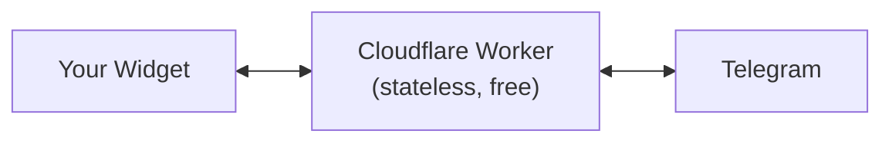

# Serverless (Lite) — Cloudflare Worker

The **lite** deployment is a free, stateless **Cloudflare Worker** that relays chat between the
PocketPing widget and Telegram. There is **no server to run and no database to manage** — state
lives in Telegram itself (one Forum Topic per visitor) plus Cloudflare's edge KV. Your bot token
stays in the Worker's secrets and **never reaches the browser**.

It's the quickest way to put a real two-way Telegram chat on your site for free.



## What's included — and what isn't

**Included**

- Two-way chat: visitor messages → Telegram, your replies → the widget
- One Telegram **Forum Topic per visitor** (organised — not one shared chat)
- Free: runs on the Cloudflare Workers free tier, no database

**Not in lite mode** — use the [Bridge Server](/self-hosting), [Hosted SaaS](https://pocketping.io),
or an [SDK](/sdk) for these:

- Discord & Slack channels
- Edit / delete sync, file attachments, AI fallback
- Long-term message history

You can move to a richer mode later **without changing the widget** — just point its `endpoint`
somewhere else.

## Deploy in about a minute (1-click)

[](https://deploy.workers.cloudflare.com/?url=https://github.com/Ruwad-io/pocketping/tree/main/cloudflare-workers/telegram-relay)

The button forks the worker into your GitHub account, connects Cloudflare,
**auto-creates the `PP` KV namespace**, lets you set `TELEGRAM_GROUP_ID` in the UI,
and ships your first deploy. After it finishes, three short steps remain.

### 1. Create the Telegram bot + supergroup

- DM **@BotFather** → `/newbot` → save the **bot token** (looks like `123456:ABC-DEF…`).
- Create a Telegram group, enable **Topics** in its settings (it becomes a forum
  supergroup), add your bot and promote it to **admin** with **Manage Topics**.
- Note the supergroup id (looks like `-1001234567890`) — e.g. message **@RawDataBot**
  in the group, then remove it.
- Paste the supergroup id into the `TELEGRAM_GROUP_ID` field in the Cloudflare deploy UI.

### 2. Set the bot token as a secret

In the Cloudflare dashboard → **Workers & Pages → `pocketping-telegram-relay` →
Settings → Variables and Secrets → Add → Secret**:

| Name | Value |
| --- | --- |
| `TELEGRAM_BOT_TOKEN` | the BotFather token |
| `TELEGRAM_WEBHOOK_SECRET` *(optional)* | any random string — verifies inbound webhook calls |

### 3. Wire Telegram + the widget

```bash
# replace <TOKEN>, the worker URL, and (if set) <SECRET>
curl "https://api.telegram.org/bot<TOKEN>/setWebhook?url=https://<your-worker>.workers.dev/telegram-webhook&secret_token=<SECRET>"
```

```html
<script src="https://cdn.pocketping.io/widget.js"></script>
<script>
  PocketPing.init({ endpoint: 'https://<your-worker>.workers.dev' });
</script>
```

That's it. Open your site and send a message — it appears in a new topic in your Telegram group.
Reply in that topic and it shows up in the widget.

### Deploy from your terminal instead

Prefer to stay local? Same outcome, no fork:

```bash
git clone https://github.com/Ruwad-io/pocketping.git
cd pocketping/cloudflare-workers/telegram-relay
npm install
npx wrangler kv namespace create PP            # paste the id into wrangler.toml
# edit wrangler.toml: set TELEGRAM_GROUP_ID = "-100…"
npx wrangler secret put TELEGRAM_BOT_TOKEN
npx wrangler deploy
```

Then run the same `setWebhook` curl and `PocketPing.init` snippet from step 3 above.

## How it stays stateless

- `KV` keeps only small mappings: session ↔ Telegram topic, and a short queue of operator replies
  per session (capped, with a TTL). There is no database to provision or back up.
- The widget uses **polling** (`GET /messages?after=…`) to fetch operator replies — which works on
  serverless edge runtimes where long-lived WebSocket/SSE connections don't.
