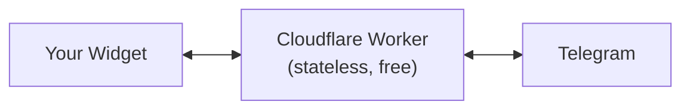

# Serverless (Lite) — Cloudflare Worker

The **lite** deployment is a free, stateless **Cloudflare Worker** that relays chat between the
PocketPing widget and Telegram. There is **no server to run and no database to manage** — state
lives in Telegram itself (one Forum Topic per visitor) plus Cloudflare's edge KV. Your bot token
stays in the Worker's secrets and **never reaches the browser**.

It's the quickest way to put a real two-way Telegram chat on your site for free.



## What's included — and what isn't

**Included**

- Two-way chat: visitor messages → Telegram, your replies → the widget
- One Telegram **Forum Topic per visitor** (organised — not one shared chat)
- Free: runs on the Cloudflare Workers free tier, no database

**Not in lite mode** — use the [Bridge Server](/self-hosting), [Hosted SaaS](https://pocketping.io),
or an [SDK](/sdk) for these:

- Discord & Slack channels
- Edit / delete sync, file attachments, AI fallback
- Long-term message history

You can move to a richer mode later **without changing the widget** — just point its `endpoint`
somewhere else.

## Deploy in about a minute

### 1. Create a Telegram bot

Message **@BotFather** → `/newbot` → save the **bot token**.

### 2. Create a supergroup with Topics

Create a group, open its settings and enable **Topics** (this converts it to a supergroup), then add
your bot as an **admin** with the **Manage Topics** permission. Note the group id (it starts with
`-100…`).

### 3. Deploy the Worker

```bash
git clone https://github.com/Ruwad-io/pocketping.git
cd pocketping/cloudflare-workers/telegram-relay
npm install

# Create the KV namespace, then paste its id into wrangler.toml ([[kv_namespaces]] id = "…")
npx wrangler kv namespace create PP

# Bot token as a secret; group id as a var in wrangler.toml ([vars] TELEGRAM_GROUP_ID = "-100…")
npx wrangler secret put TELEGRAM_BOT_TOKEN

npx wrangler deploy
```

### 4. Point Telegram at the Worker

```bash
curl "https://api.telegram.org/bot<TOKEN>/setWebhook?url=https://<your-worker>.workers.dev/telegram-webhook"
```

### 5. Point the widget at the Worker

```html
<script src="https://cdn.pocketping.io/widget.js"></script>
<script>
  PocketPing.init({ endpoint: 'https://<your-worker>.workers.dev' });
</script>
```

That's it. Open your site and send a message — it appears in a new topic in your Telegram group.
Reply in that topic and it shows up in the widget.

## How it stays stateless

- `KV` keeps only small mappings: session ↔ Telegram topic, and a short queue of operator replies
  per session (capped, with a TTL). There is no database to provision or back up.
- The widget uses **polling** (`GET /messages?after=…`) to fetch operator replies — which works on
  serverless edge runtimes where long-lived WebSocket/SSE connections don't.
