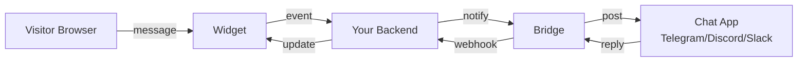
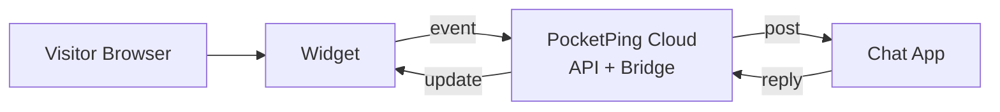
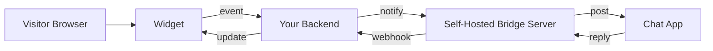
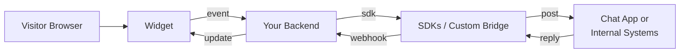

# Architecture & Concepts

PocketPing connects a website widget to real-time notifications in your chat apps.
This document explains the moving parts and how data flows between them.

## Core Components

- Widget: JavaScript client embedded on your site. Handles chat UI, session state,
  and WebSocket connection to your backend.
- Your Backend: Receives widget events, applies your business logic, and forwards
  messages to a Bridge.
- Bridge: Service that translates PocketPing events into chat-app messages
  (Telegram/Discord/Slack) and routes replies back to your backend.
- SDKs: Optional libraries that simplify signing, payload validation, and
  sending events from your backend.

## Message Flow (High Level)

1) Visitor sends a message in the widget.
2) Widget sends the message to your backend.
3) Backend forwards the message to a Bridge.
4) Bridge posts to your chat app.
5) You reply in chat; the Bridge sends the reply back to your backend.
6) Backend sends the reply to the widget in real time.

## Deployment Modes

- SaaS: Use PocketPing hosted endpoints.
- Bridge Server (self-hosted): Run the Go bridge to integrate chat apps.
- SDK Integration (self-hosted custom): Use SDKs to integrate with your own
  messaging pipeline.

### Mode 1: Community / SaaS (Hosted)

Best when you want the fastest setup and no infra to manage.

Use cases:
- Launch quickly on a landing page or marketing site.
- Small teams that want alerts on Telegram/Discord/Slack without hosting.

### Mode 2: Bridge Server (Self‑Hosted Standalone)

Best when you want control over integrations and data flow, but minimal backend
work. Your backend only calls the Bridge API.

Use cases:
- You already have a backend and want to keep data on your servers.
- You need custom routing, tagging, or compliance rules.

### Mode 3: SDK Integration (Self‑Hosted Custom)

Best when you want full control and can plug PocketPing events into your own
messaging or workflow stack.

Use cases:
- You already run a support system and only need the widget + event stream.
- You want to fan out to multiple tools (CRM, ticketing, analytics).

## Design Principles

- Phone-first support: notifications land in tools you already use.
- Minimal integration: keep the widget lightweight and backend simple.
- Extensible: custom events and AI fallback are opt-in features.

## Where to Look Next

- README Quick Start and setup guides
- Bridge Server docs: bridge-server/README.md
- SDKs: packages/sdk-*
